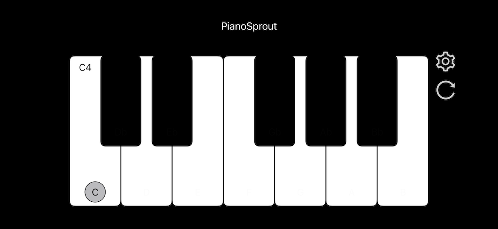

[English](README.md) | [简体中文](README.zh.md) | [繁體中文](README.zh-Han.md) | [Français](README.fr.md) | [Deutsch](README.de.md) | **日本語** | [한국어](README.ko.md) | [Português](README.pt.md) | [Español](README.es.md)

# PianoSprout App

デバイスを魔法のピアノに変えましょう！スキルは不要です。光るキーをタップするだけで、スマートエンジンがリズムを処理します。誰でも楽しめるシンプルでリラックスできるアプリです。

[App Store](https://apps.apple.com/app/1519974306) でアプリをインストール

フィードバックは [issue](https://github.com/embbnux/pianosprout-app/issues/new) を作成してください。**issueに機密データを含めないでください**。

## 説明

数秒で美しい音楽を奏でる – 経験は不要です！

PianoSprout は単なるシミュレーターではありません。誰でもプロのように聞こえる楽しい音楽おもちゃです。子供でも、子供のような心を持った大人でも、お気に入りの曲を簡単に演奏できることを気に入るはずです。

【楽しいポイントは？】

- マジックモード（自動持続）

複雑なタイミングは忘れましょう！キーが光ったら正しいキーをタップするだけ。

アプリが自動的に完璧な長さで音符を演奏します。あなたが速度をコントロールし、リズムはアプリにお任せ。まるで魔法のようです！

- クールなサウンドを探索

普通のピアノに飽きましたか？ギター、バイオリン、その他の楽器に瞬時に切り替えられます。

高品質な効果音（SoundFonts）で、タップするたびに満足感が得られます。

- シンプル＆リラックス

ライトアップガイド：ヒントに従って、「ジングルベル」のような名曲を簡単に演奏できます。

自由な創造性：フリープレイモードに切り替えて、マルチタッチキーボードを楽しんでください。レッスンのストレスなしに、内なるミュージシャンとつながりましょう。

【特徴】

カラフルでクリーンなインターフェース。

iPhone と iPad で快適に動作します（デュアルキーボードを試してみてください！）。

ちょっとしたクリエイティブな休憩や、小さなお子様を楽しませるのに最適です。

[プライバシー](./privacy.jp.md)
